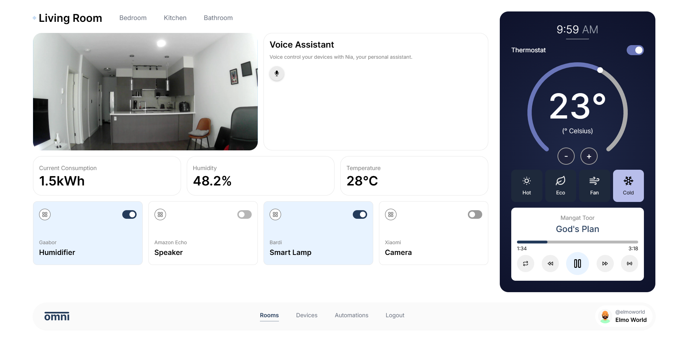

# Omni

<!--  -->
An innovative smart home application developed during nwHacks2025 in just 24 hours. It unifies major smart home standards and leverages Wi-Fi CSI (Channel State Information) for presence detection and gesture recognition, eliminating the need for intrusive cameras. With Omni, users can seamlessly automate tasks, control devices, and monitor their home’s environment through an intuitive web application, all while prioritizing privacy and convenience.

> [!IMPORTANT]
> While the current repository contains the core application, additional hardware will be required to fully experience Omni's full functionality which includes a Wi-Fi CSI module, a Google Coral Edge TPU, and the setup of a live stream server to connect the app to your home environment. We are actively working on improving the project to make it easier for others to test and use in the future as we continue development beyond the hackathon.

_Check out the devpost submission [_here_](https://devpost.com/software/omni-pt4ia1)._

## Table of Contents

* [Screenshots](#screenshots)
* [Acknowledgements](#acknowledgements)
* [Technologies](#technologies)
<!-- * [Usage](#usage)
  * [Prerequisites](#prerequisites)
  * [Installation](#installation)
  * [Environment Variables Setup](#environment-variables-setup)
  * [Run The App](#run-the-app) -->
* [Features](#features)
  * [Presence and Gesture Recognition](#presence-and-gesture-recognition)
  * [Home Monitoring](#home-monitoring)
  * [Device Management and Automation](#device-management-and-automation)
  * [Voice Assistant](#voice-assistant)

## Screenshots

|  |  |
|:--:|:--:|
| _Login Page_ | _Rooms Page_ |
|  |  |
| _Devices Page_ | _Automations Page_ |

## Acknowledgements

* Bhavnoor Saroya [GitHub](https://github.com/BhavnoorSaroya) [LinkedIn](https://www.linkedin.com/in/bhavnoor-saroya)
* Mangat Toor [GitHub](https://github.com/immangat) [LinkedIn](https://www.linkedin.com/in/immangat)
* Noufil Saqib [GitHub](https://github.com/noufilsaqib) [LinkedIn](https://www.linkedin.com/in/muhammad-noufil-saqib/)
* Towa Quimbayo [GitHub](https://github.com/towaquimbayo) [LinkedIn](https://www.linkedin.com/in/towa-quimbayo/)

## Technologies

* React.js `v18.3.1`
* React Audio Visualize `v1.2.0`
* React Helmet `v6.1.0`
* Hls.js `v1.5.19`
* TailwindCSS `v3.4.17`
* TypeScript `v5.6.2`
* Vite `v6.0.5`
* Python
* Flask `v3.0.3`
* Keras `v2.13.1`
* Numpy `v1.24.3`
* Pandas `v2.0.3`
* PyAudio `v0.2.14`
* Scikit-Learn `v1.3.2`
* Transformers `v4.46.3`

## Features

### Presence and Gesture Recognition

* __Wi-Fi CSI Detection__: Utilizes Wi-Fi CSI (Channel State Information) to detect motion, recognize gestures, and identify room-level presence without the need for using intrusive cameras.
* __Privacy-First Design__: Eliminates the need for cameras, ensuring greater privacy in sensitive areas like bathrooms or bedrooms.

### Home Monitoring

* __Room Statistics Dashboard__: Displays real-time data for connected rooms including temperature, humidity, and power consumption.
* __Integrated Thermostat__: Control and adjust your room’s temperature directly from the app.
* __Room Live Stream__: Set up live camera feeds for enhanced monitoring, enabling you to view specific rooms directly through the app.

### Device Management and Automation

* __Device Management__: View, connect, and control a list of smart devices including lights, speakers, doors, vacuums, and more with ease, providing full control over your smart home ecosystem.
* __Customizable Automation__: Create tailored automations such as turning on entrance lights, starting a coffee machine, and playing music upon detecting your arrival.

### Voice Assistant

* __Local Speech Processing__: Leveraging a Google Coral Edge TPU, Omni processes voice commands locally for faster, more private interactions.
* __Wake-Word Detection__: Includes natural language processing to understand and execute commands, enabling natural interaction with your smart home.
